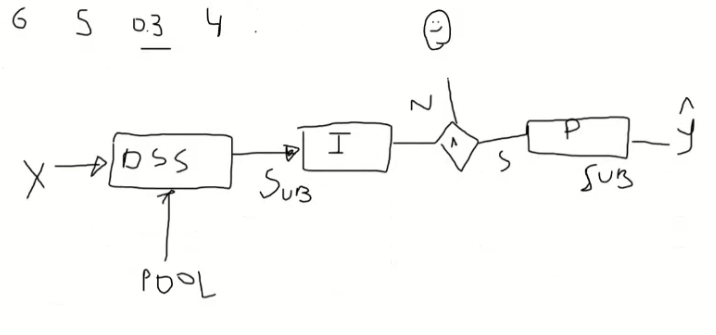
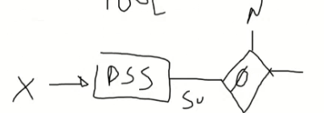

# 24/08

**Pool de modelos**

- Dentro do pool vc seleciona os melhores modelos (mais competentes) para classificar uma instância
  - Se nenhum for bom, então rejeita uma instância
  - Exemplo de fronteira: seria rejeitado por vários modelos, mas talvez aceito por algum grupo de modelos

- Codificar incertezas pela probabilidade de classe e tirar a incerteza baseada nisso (com ponto de corte 0.8)

- Taxa de rejeição: quantos % máximo da amostra de dados você pode rejeitar (seria classificado manualmente). Com um classificador é moleza, mas com vários é mais complicado pq nn seria exatamente 20%
  - Nesse caso, a questão é: Como escolher esses 20%? Tirar uma **média/mediana das probabilidades de classe**? Ou pela **mínima/máxima probabilidade do pool** (para cada instância, usar a mínima/máxima probabilidade da classe correta dela entre os classificadores do DSS-Dynamic Subgroup Selector...? ) ? 

  - Esquema:
    
    - *(Se for seguir esse esquema, então seria usado, na verdade, um rejeitor separado dos modelos, ao invés de ser dependente deles)*

  - Primeiro precisa ver as instâncias que foram rejeitadas por todos os modelos. Essas *tem* que contar nos 20% 
  
    

- Começar fazendo sem assessores. Apenas pelas probabilidades de classes

- Como medir a performance do modelo? Medindo a acurácia das predições das instâncias escolhidas, pelos modelos escolhidos.

- Verificar o dataset a ser utilizado, provavelmente um do airbnb que usaram em um dos papers que prudêncio mencionou na reunião. verificar métricas e coisas sobre machine learning com opção de rejeição.

